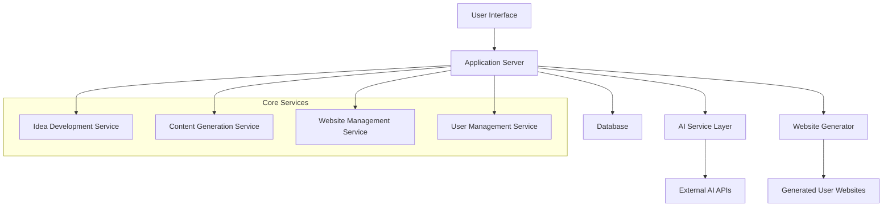

# Design Document

## Overview

The Nonprofit Idea Coach is a web application that combines structured coaching with AI-powered content generation to help users transform cause-based ideas into actionable nonprofit initiatives. The system consists of two main phases: an idea development session that guides users through detailed planning, and a personalized website generator that provides ongoing implementation support through AI-assisted tools.

## Architecture

### High-Level Architecture



### Technology Stack

- **Frontend**: React.js with TypeScript for the main coaching interface
- **Backend**: Python with Flask/FastAPI for API services
- **Database**: PostgreSQL for user data and idea storage
- **AI Integration**: OpenAI GPT API for content generation and embedded chatbots
- **Website Generation**: Static site generator (Next.js) for user websites with Apple-inspired clean design
- **Hosting**: Cloud platform (AWS/Vercel) for scalability
- **Authentication**: JWT-based authentication system
- **Real-time Chat**: WebSocket integration for embedded chatbots in each section

## Components and Interfaces

### 1. Idea Development Module

**Purpose**: Guides users through structured questioning to refine their nonprofit concept

**Key Components**:
- `QuestionnaireEngine`: Manages the flow of questions and validates responses
- `IdeaAnalyzer`: Processes user responses to identify gaps and suggest improvements
- `ProgressTracker`: Monitors completion status and saves progress

**Interface**:
```typescript
interface IdeaSession {
  sessionId: string;
  userId: string;
  responses: QuestionResponse[];
  completionStatus: SessionStatus;
  createdAt: Date;
  updatedAt: Date;
}

interface QuestionResponse {
  questionId: string;
  question: string;
  answer: string;
  followUpPrompts?: string[];
}
```

### 2. AI Content Generation Service

**Purpose**: Creates personalized content for marketing, team building, funding, and research

**Key Components**:
- `ContentGenerator`: Interfaces with AI APIs to generate specific content types
- `TemplateManager`: Manages content templates and formatting
- `ContentValidator`: Ensures generated content meets quality standards

**Interface**:
```typescript
interface ContentRequest {
  type: 'marketing' | 'team' | 'funding' | 'research';
  subtype: string; // 'flyer', 'email', 'pitch', etc.
  ideaContext: IdeaSummary;
  additionalParams?: Record<string, any>;
}

interface GeneratedContent {
  contentId: string;
  type: string;
  content: string;
  metadata: ContentMetadata;
  generatedAt: Date;
}
```

### 3. Website Generator

**Purpose**: Creates and manages personalized websites for each user's nonprofit with clean, Apple-inspired design

**Key Components**:
- `SiteBuilder`: Generates static websites based on user's idea and preferences
- `TemplateEngine`: Manages website templates with theme customization based on nonprofit cause
- `DeploymentManager`: Handles website hosting and URL management
- `ChatbotIntegrator`: Embeds AI chatbots in each section for interactive content creation

**Interface**:
```typescript
interface UserWebsite {
  websiteId: string;
  userId: string;
  subdomain: string;
  ideaSummary: IdeaSummary;
  sections: WebsiteSection[];
  customization: SiteCustomization;
  deploymentStatus: DeploymentStatus;
}

interface WebsiteSection {
  sectionType: 'marketing' | 'team' | 'funding' | 'research';
  content: GeneratedContent[];
  chatbotConfig: ChatbotConfiguration;
  menuOptions: SectionMenuOption[];
  isActive: boolean;
}

interface SectionMenuOption {
  optionId: string;
  label: string;
  contentType: string; // 'email', 'flyer', 'poster', 'pitch', etc.
  isEnabled: boolean;
}
```

### 4. User Management System

**Purpose**: Handles user authentication, profiles, and access control

**Key Components**:
- `AuthService`: Manages user registration, login, and JWT tokens
- `UserProfileManager`: Stores and manages user information and preferences
- `AccessController`: Controls access to generated websites and content

## Data Models

### User Model
```typescript
interface User {
  userId: string;
  email: string;
  passwordHash: string;
  profile: UserProfile;
  createdAt: Date;
  lastLoginAt: Date;
}

interface UserProfile {
  firstName: string;
  lastName: string;
  location?: string;
  interests?: string[];
  experience?: string;
}
```

### Idea Summary Model
```typescript
interface IdeaSummary {
  ideaId: string;
  userId: string;
  title: string;
  description: string;
  importance: string;
  targetBeneficiaries: string;
  implementationMethod: string;
  significance: string;
  uniqueness: string;
  additionalDetails: Record<string, string>;
  status: 'draft' | 'complete' | 'implemented';
}
```

### Content Library Model
```typescript
interface ContentLibrary {
  userId: string;
  marketingContent: GeneratedContent[];
  teamContent: GeneratedContent[];
  fundingContent: GeneratedContent[];
  researchContent: GeneratedContent[];
  lastUpdated: Date;
}

interface VolunteerManagement {
  volunteerId: string;
  name: string;
  address: string;
  email: string;
  phoneNumber: string;
  taskAssignment: string;
  userId: string;
  createdAt: Date;
  updatedAt: Date;
}

interface ChatbotConfiguration {
  sectionType: string;
  isEnabled: boolean;
  contextPrompt: string;
  availableActions: string[];
}
```

## Error Handling

### Error Categories
1. **Validation Errors**: Invalid user input or incomplete responses
2. **AI Service Errors**: API failures or content generation issues
3. **Database Errors**: Connection issues or data integrity problems
4. **Website Generation Errors**: Template processing or deployment failures

### Error Handling Strategy
- **Graceful Degradation**: Provide fallback content when AI services are unavailable
- **Retry Logic**: Implement exponential backoff for transient failures
- **User Feedback**: Clear error messages with actionable guidance
- **Logging**: Comprehensive error logging for debugging and monitoring

### Error Response Format
```typescript
interface ErrorResponse {
  error: {
    code: string;
    message: string;
    details?: any;
    timestamp: Date;
  };
  requestId: string;
}
```

## Testing Strategy

### Unit Testing
- Test individual components and services in isolation
- Mock external dependencies (AI APIs, database)
- Focus on business logic and data validation
- Target 80%+ code coverage for core functionality

### Integration Testing
- Test API endpoints and database interactions
- Verify AI service integration and content generation
- Test website generation and deployment processes
- Validate user authentication and authorization flows

### End-to-End Testing
- Test complete user journeys from idea development to website creation
- Verify generated websites function correctly
- Test AI content generation across all sections
- Validate user experience across different devices and browsers

### Performance Testing
- Load testing for concurrent users during idea development sessions
- Stress testing for AI content generation under high demand
- Website generation performance optimization
- Database query optimization and indexing

## Security Considerations

### Data Protection
- Encrypt sensitive user data at rest and in transit
- Implement proper password hashing (bcrypt)
- Secure API endpoints with rate limiting
- Regular security audits and vulnerability assessments

### AI Content Safety
- Content filtering to prevent inappropriate generated content
- User reporting system for problematic content
- Regular review of AI-generated materials
- Compliance with content generation best practices

### Website Security
- Secure subdomain generation and management
- Protection against XSS and injection attacks
- Regular security updates for generated websites
- Monitoring for malicious activity on user websites
## In
teractive Features Design

### Embedded Chatbots
Each section (marketing, team building, funding, research) will include an embedded chatbot that:
- References the user's detailed idea document for context-aware responses
- Provides interactive content creation with review and revision capabilities
- Offers real-time suggestions and improvements
- Maintains conversation history for each section

### Menu/Button System
Each section will feature intuitive menu options:

**Marketing Section**:
- Create Email Templates
- Design Flyers
- Generate Posters
- Write Advertisements
- Social Media Content

**Team Building Section**:
- Volunteer Management Dashboard
- Create Recruiting Materials
- Generate Hiring Guidance
- Task Assignment Tools
- Volunteer Communication Templates

**Funding Section**:
- Identify Funding Sources
- Generate Grant Proposals
- Create Donor Communications
- Cost Planning Tools
- Budget Templates

**Research Section**:
- Local Organization Research
- Implementation Step Planning
- Resource Link Compilation
- Best Practices Research
- Regulatory Guidance

### Design Philosophy
Following Apple's design principles:
- Clean, minimalist interface with plenty of white space
- Intuitive navigation with clear visual hierarchy
- Consistent typography and color schemes
- Responsive design for all device types
- Smooth animations and transitions
- Focus on user experience and accessibility

### Theme Customization
Website themes will be automatically selected based on the nonprofit's cause:
- Environmental causes: Green and earth tones
- Education: Blue and academic colors
- Health: Medical blues and whites
- Community: Warm, welcoming colors
- Arts: Creative and vibrant palettes
- Social justice: Bold, impactful colors